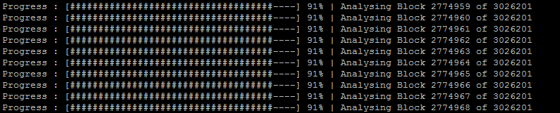

# OwnBlockchainDowntimeReportTool

A tedious bash script to fulfil two simple goals;

- Highlight benefit of Distributed Ledger Technology & Blockchain (immutable block timestamps) identify periods greater than one hour between block proposal (outages)

- Hold CEO's account for their words on this issue (context: https://www.youtube.com/watch?v=g18dQxOcD0Q&t=1580s)

## How to start it?

Install and syncronise a WeOwn blockchain node. see: https://github.com/OwnMarket/OwnBlockchain

Ensure all dependencies are installed, jq, tee etc

From the server with node installed:

`git clone https://github.com/justanotherbagholder/OwnBlockchainDowntimeReportTool.git` `cd OwnBlockchainDowntimeReportTool && ./OwnBlockchainDowntimeReportTool.sh`

## Screenshot

## Example Report

See report for the mainnet blockchain (blocks 2-3000000) located in reports folder